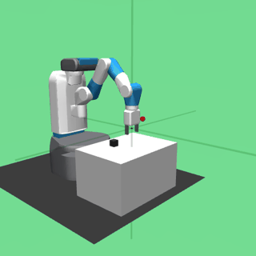

# lang2act

<p align="center"></p>

<p align="center"><b>🔴 Live demo: <a href="https://lang2act.streamlit.app">lang2act.streamlit.app</a></b> — step through real agent runs, or drive the robot yourself.</p>

**Natural-language goal in → robot motion out.** A multi-agent system that
drives a simulated Fetch robot arm (MuJoCo) from plain-English instructions,
powered entirely by an **open-weights vision-language model served locally** —
no cloud APIs, no GPU, no accounts. The whole stack runs on a dual-core laptop.

```
"pick up the block and place it on the target marker"
        │
        ▼
┌─────────────┐   plan    ┌──────────────┐  JSON tool calls  ┌──────────────┐
│   PLANNER    │ ────────▶ │   EXECUTOR    │ ────────────────▶ │  ROBOT LAYER  │
│ task + image │           │ tool loop w/  │   go_to / grasp   │ P-controlled  │
│  → step plan │           │ camera + state│ ◀──────────────── │  primitives   │
└─────────────┘           └──────┬───────┘   result + frame   └──────┬───────┘
                                  │ episode ends                      │
                                  ▼                                   ▼
                          ┌──────────────┐    final frame     ┌──────────────┐
                          │   VERIFIER    │ ◀───────────────── │ MuJoCo Fetch  │
                          │ fresh context │   judges success   │ PickAndPlace  │
                          └──────────────┘                     └──────────────┘
```

## What's interesting here

- **Three agent roles, isolated contexts.** The planner decomposes the task
  from the first camera frame; the executor runs a grammar-constrained tool
  loop; the verifier judges the *final image* in a fresh context — it cannot
  be talked into success by the executor's own narrative.
- **Constrained decoding instead of hoping.** Every model reply is forced
  through a JSON schema (llama.cpp grammar sampling), so a 3B model can never
  emit an unparseable action. Small models + hard constraints beat big models
  + string parsing for reliability per dollar.
- **Language → primitives → control.** The LLM never emits raw joint deltas.
  It composes typed skill primitives (`go_to`, `open_gripper`, …), each a
  closed-loop P-controller over dozens of sim steps — the same layering used
  to put LLM agents on real robotic platforms.
- **Context engineering for slow hardware.** Only the latest camera frame
  stays in the executor's context; older frames collapse into text
  placeholders, and history beyond six exchanges rolls off. Prompts stay
  small enough that CPU-only inference remains usable.
- **Evaluated, not vibed.** `eval/run_eval.py` reports task success against
  environment ground truth (block within 5 cm of target), verifier agreement
  with that ground truth, latency, and token spend. `tests/test_robot.py`
  proves the primitive layer solves the task 100% scripted, so agent failures
  are attributable to the agent, not the plumbing. Every episode writes a
  JSONL trace of each plan, action, result, and verdict.

## Stack

| layer | choice | why |
|---|---|---|
| model | Qwen2.5-VL-3B-Instruct (GGUF Q4_K_M, Hugging Face) | vision + planning in one open model, fits in laptop RAM |
| serving | llama.cpp `llama-server` | OpenAI-compatible API; swap in Ollama/vLLM/hosted without touching agent code |
| sim | MuJoCo + gymnasium-robotics `FetchPickAndPlace-v4` | standard robotics benchmark, headless EGL rendering |
| client | ~90-line `httpx` wrapper | provider-agnostic; no framework lock-in |

## Run it

```bash
scripts/setup.sh        # venv + deps + llama.cpp + model weights (~2.7 GB)
scripts/serve.sh        # start the local model server (loads in a few minutes)

# in another terminal:
.venv/bin/python -m lang2act.main "pick up the block and place it on the target"
.venv/bin/python -m tests.test_robot        # sim-only: primitives, no LLM
.venv/bin/python -m tests.test_llm_vision   # vision pipeline smoke test
.venv/bin/python -m eval.run_eval --episodes 10
```

On a 2-core i5-6200U (no GPU), one episode takes ~10 minutes; the eval suite
is an overnight job. Point `LANG2ACT_BASE_URL` at any faster OpenAI-compatible
endpoint and the identical agent runs at interactive speed.

## Layout

```
lang2act/
  llm.py      OpenAI-compatible chat client (json_schema constrained decoding)
  robot.py    Fetch wrapper + closed-loop motion primitives
  tools.py    typed tool surface + action schema + dispatch
  agent.py    planner / executor / verifier orchestration
  trace.py    JSONL episode tracing
  main.py     CLI
eval/run_eval.py   success rate, verifier agreement, latency, tokens
tests/             primitives test (no LLM) + vision pipeline test
scripts/           setup.sh, serve.sh
```

## Roadmap

- Pure-vision grounding: drop oracle object coordinates; localize the block
  from pixels (the verifier already works image-only)
- Retry loop: feed the verifier's failure assessment back into a re-plan
- Multi-object scenes and relational instructions ("stack red on blue")
- Same agent against a real arm over the identical tool interface

## License

MIT
